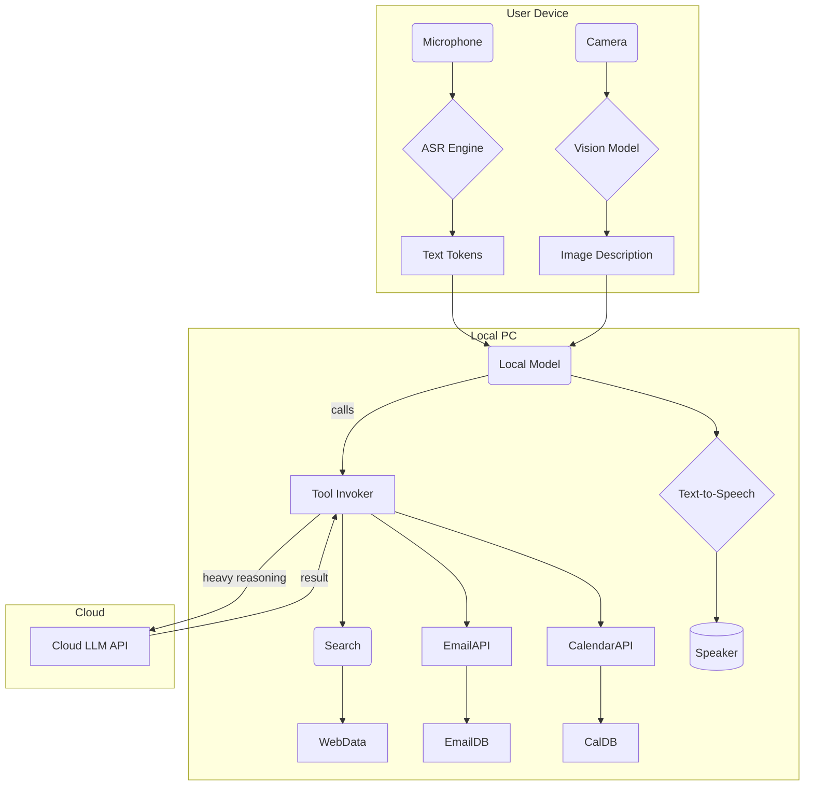
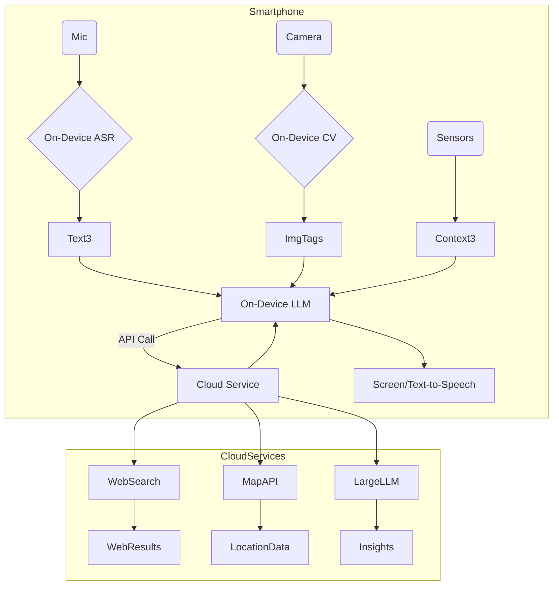

# Building a Jarvis-like AI Assistant: Models, Architectures, and Deployment

**Executive Summary:** Designing a “Jarvis”-style multimodal assistant today requires uniting advances in *large language models* (LLMs) and deep learning with robust system engineering.  Modern LLMs (like GPT-4, LLaMA, Claude) are transformer-based deep networks trained on massive text corpora, enabling them to understand and generate human language【3†L230-L238】【18†L382-L390】.  Computer vision and perception rely on Convolutional Neural Networks (CNNs) and emerging Vision Transformers (ViTs): CNNs excel at processing images via learned filters【8†L400-L408】, while ViTs apply transformer-style self-attention to image patches.  Recurrent models (RNNs, LSTMs) handle sequential data (e.g. speech, time series) with internal memory【11†L229-L238】【13†L351-L359】.  Multimodal models (e.g. CLIP, GPT-4o, PaLM-E) combine modalities (text, vision, audio) to understand and generate across media【20†L221-L229】.  Agent frameworks like **ReAct** (chain-of-thought with tool calls), **Toolformer**, **LangChain**, and **AutoGPT** wrap LLMs into decision-making loops. For example, a ReAct agent interleaves “Thought: …” and “Action: [tool]” steps to plan and act【22†L149-L158】, and Toolformer trains LLMs to decide when and how to call APIs for tools like search or calculators【24†L54-L63】.  

Architecturally, real-time assistants can range from *on-device pipelines* (using tiny LLMs and specialized accelerators) to *cloud-based services* (giant LLMs on GPU clusters).  On-device inference minimizes latency and privacy risk by running models locally, but at the cost of smaller models and compressed representations【39†L370-L378】【55†L106-L115】.  Cloud deployments leverage massive computation (GPUs/TPUs) to handle large models, but incur network delays (often ~100–200ms per token) and data exposure【39†L370-L378】【39†L394-L402】.  In practice a **hybrid** edge–cloud approach can give the best of both: a lightweight model runs on the device for fast responses, while heavier reasoning or planning is offloaded to the cloud【39†L370-L378】【55†L106-L115】.  

Integration patterns follow a *sense–think–act* pipeline: audio (via ASR, e.g. Whisper Transformer) and vision (via CNN/ViT) feed into the LLM “brain”; an episodic memory (vector database) stores embeddings of past interactions【48†L1782-L1790】; planning is done via chain-of-thought prompts or symbolic planners; actions trigger tools or APIs (e.g. calendar APIs, home IoT controls)【48†L1766-L1773】.  Orchestrators like LangChain or MetaGPT connect multiple agents or specialist sub-agents (e.g. a vision agent, a dialogue agent) into a workflow.  Safety and privacy are critical: LLMs can hallucinate or be manipulated (prompt injection, data poisoning)【50†L90-L98】【53†L223-L232】, so outputs must be filtered or supervised.  Data privacy favors local processing or encryption, and robust guardrails (zero-trust design, human-in-loop) mitigate misuse【39†L370-L378】【53†L229-L236】.  

Finally, practical deployment involves balancing hardware, software, and cost. High-end GPUs (Nvidia A100/H100) run cloud inference ($2–$5 per GPU-hour【64†L49-L57】), while phones and embedded chips (e.g. Snapdragon NPUs, Jetson Xavier) enable on-device models.  Software stacks include frameworks like PyTorch/TensorFlow, container orchestration (Kubernetes), and ML toolkits (ONNX, CoreML).  We present example system designs for (A) a desktop assistant, (B) a home automation/robotics controller, and (C) a mobile multimodal assistant, each with component diagrams (below).  Throughout, we cite recent literature and official sources to ground our analysis in the state of the art【3†L230-L238】【39†L370-L378】【55†L106-L115】【60†L121-L130】.

## 1. Foundations: Models and Architectures 

- **Large Language Models (LLMs):**  LLMs are deep neural networks (transformers) trained on vast text corpora to understand and generate language【3†L230-L238】.  They excel at capturing syntactic and semantic patterns (translation, summarization, Q&A) and can often generalize via few-shot prompts.  The transformer backbone uses self-attention and positional encoding to process whole sequences in parallel【18†L382-L390】【18†L394-L402】.  Modern LLMs (GPT, LLaMA, Gemini) commonly use decoder-only or encoder-decoder transformer stacks.  Key strengths: *contextual understanding*, flexible generation, emergent reasoning.  Weaknesses: *compute-intensive inference*, tendency to “hallucinate” (fabricate facts), large data/training costs.  Example capability: GPT-4 can answer complex questions and follow conversation context for many turns【18†L398-L402】.

- **Convolutional Neural Networks (CNNs):**  CNNs are feedforward networks that learn spatial features via convolutional filters【8†L400-L408】.  They have been the backbone of computer vision tasks (image classification, object detection, segmentation).  Strengths: very effective on image data, translational invariance, generally lower inference cost than transformers.  Weaknesses: limited ability to model long-range context (unless very deep or large kernels).  In multimodal assistants, CNNs or hybrid CNN-ViTs handle vision sub-tasks like recognizing objects or reading text from camera input.

- **Recurrent Neural Networks (RNNs) and LSTMs:**  RNNs process sequential data by maintaining a hidden state across time steps【11†L229-L237】. LSTMs are a gated RNN variant designed to alleviate vanishing gradients, enabling longer memory【13†L351-L359】. They were historically used for speech recognition, language modeling, and time-series.  Strengths: natural for time-series, online processing. Weaknesses: sequential nature limits parallelization and speed.  Today, transformers often outperform RNNs in NLP and ASR, but RNN/LSTM inference is still common in compact on-device ASR or embedded systems.

- **Transformers:**  As noted, transformers form the basis of modern LLMs and are now common in vision (Vision Transformers), audio, and multimodal models【18†L382-L390】.  Unlike RNNs, transformers can attend to any part of the input in each layer, yielding superior long-range dependency modeling.  Strengths: *parallel processing*, scalability with data (scaling laws【43†L59-L68】), versatility across domains.  Weaknesses: *quadratic compute/attention costs* with sequence length, high memory use.  For an assistant, transformers power both the language understanding and, increasingly, perception (e.g. object captions via transformer image encoders).

- **Multimodal Models:**  These models ingest and produce multiple data types (text, image, audio).  Examples: OpenAI’s CLIP (images+text embeddings), DALL-E (text-to-image), GPT-4o and LLaVA (vision+language).  Multimodal LLMs can answer questions about images, listen and respond, or integrate sensor data.  Strengths: richer context (e.g. disambiguating an utterance by vision cues), unified reasoning across modalities【20†L221-L229】.  Weaknesses: much larger models (often requiring billions of parameters), complex training pipelines, and still emerging tooling.  Recent surveys emphasize that foundation models now include ViTs and “LLM-based multimodal” systems, but highlight their huge resource demands【43†L20-L28】【43†L90-L99】.

- **Agent Frameworks:**  Beyond raw models, agent frameworks structure LLMs into goal-driven systems.  - *ReAct (Reason+Act)* prompts the model to alternately generate thoughts and actions, using tools/APIs as needed.  A ReAct agent might internally “think: to solve this, I should search Wikipedia” then “action: search(…)”【22†L149-L158】.  - *Toolformer* trains LMs to self-select API calls.  It showed that a model can learn when to call a calculator or search engine to improve accuracy【24†L54-L63】.  - *LangChain* is an open-source framework providing agent templates (often ReAct-style) with pluggable tools and memory【26†L54-L62】.  - *AutoGPT* and variants (BabyAGI, etc.) create persistent goal-driven agents with memory; once given a goal, they autonomously break tasks into sub-tasks and act (e.g. searching, writing code, emailing)【30†L349-L358】.  These frameworks specify *tool specs* (e.g. “`Search(query)` returns web results”) and few-shot examples, enabling end-to-end chains of thought/action.

## 2. Architectures for Real-Time, Multimodal Assistants 

Designing an assistant involves choosing the right mix of models for low latency and high accuracy:

- **Modality Pipelines vs. Unified Models:**  One approach is modular: use separate ASR (e.g. Whisper), separate vision model (e.g. ResNet or YOLO), then feed their outputs to an LLM or planning module. This allows specialized tuning per sensor, and partial on-device deployment (e.g. small vision model on phone).  Alternatively, end-to-end *multimodal transformers* (like Flamingo, GPT-4v) can directly take raw inputs (image pixels, speech spectrograms) and produce responses.  Modality pipelines are easier to optimize for latency (each part can be deployed on appropriate hardware) but require designing data interchange and interfaces.  Unified models simplify integration but can be huge (e.g. hundreds of billions of parameters) and require powerful hardware.

- **Compute and Latency Trade-offs:**  Transformer-based LLMs (100B+ parameters) deliver state-of-art reasoning, but even with optimized inference they are slow and power-hungry: e.g. GPT-4 (cloud) generates ~1 token per 200ms【39†L394-L402】.  Smaller models (7–13B) on edge can generate tokens in ~50–100ms【39†L394-L402】.  CNNs for vision inference can be very fast on GPU/edge-TPU (tens of milliseconds per image).  RNN/LSTM speech models can run real-time on modern CPUs, but transformers (like Whisper) yield better accuracy at the cost of ~100ms delay per second of audio.  Overall, a real-time assistant might budget <200ms for ASR, <100ms for preliminary response generation, and strive for sub-500ms total “time-to-first-response” for natural conversation【57†L123-L132】.  

- **On-Device vs. Cloud:**  On-device inference minimizes network delay and avoids sending private data off-device【39†L370-L378】. For example, Google’s on-device Gemini Nano can label an image and speak the description offline【39†L402-L410】. Qualcomm’s benchmark showed that running models on a Snapdragon phone can cut energy and latency by ~90% compared to cloud inference【55†L106-L115】. However, on-device models must be compressed (quantized/pruned) or inherently small (under 10B parameters)【39†L370-L378】【39†L438-L446】. Cloud inference allows arbitrarily large models and shared memory (vector DBs), but adds network latency (~100–200ms roundtrip per query【39†L394-L402】) and recurring cost.  A **hybrid** strategy often works best: use a tiny model locally for immediate feedback (and privacy-critical queries), and delegate heavy reasoning to the cloud when needed【39†L370-L378】【55†L106-L115】.  

- **Training vs. Fine-Tuning:**  Building such an assistant usually involves fine-tuning or prompt-tuning existing foundation models rather than training from scratch (which costs tens of millions in compute【43†L70-L79】).  For example, one might fine-tune an open LLM (LLaMA 2, Mistral) on domain dialogs, or use adapters/LoRA.  Multimodal assistants can leverage pre-trained vision-language models (e.g. LLaVA) and add prompt-engineered scaffolding.  Data needs are large for base training, but modest for fine-tuning (thousands of curated examples).  Continual learning or retrieval-augmented generation (RAG) can keep the assistant up-to-date without full retraining.  

- **Strengths & Weaknesses Table:**  Below is a high-level comparison:

  | Model/Architecture             | Strengths                                               | Weaknesses                                               | Latency          | Compute/Data Needs         |
  |:-------------------------------|:--------------------------------------------------------|:---------------------------------------------------------|:-----------------|:---------------------------|
  | **Large Transformer (LLM)**    | Excellent language understanding; few-shot flexibility【3†L230-L238】 | Very large; high latency/power; hallucinate errors       | High (100–200ms/token)【39†L394-L402】 | High (billions of tokens for training) |
  | **Vision CNN/ViT**             | Accurate visual features; fast on GPU/edge              | CNN less effective on sequences; ViT still heavy         | Moderate (<50ms/image on GPU) | Training on image datasets      |
  | **ASR (Transformer/RNN)**      | High speech accuracy; real-time options (LSTM)          | Transformer ASR is slower; RNNs less accurate            | ~200ms per second of audio      | Speech corpora needed      |
  | **Small On-Device LLM (<10B)** | Fast (tens of ms/token) on phone NPU; local/private      | Limited capacity; may lack nuance                        | Low (tens of ms)【39†L394-L402】    | Can use distillation/quant.  |
  | **Multimodal Fusion (e.g. CLIP)** | Unified perception; cross-modal queries                 | Limited by smallest modality; complex training           | Varies (sum of each) | Large annotated multi-modal dataset |
  | **ReAct/Tool-Using Agent**     | More capable tasks (tool calls, reasoning chains)【22†L149-L158】 | Reliant on correct tool design; harder to verify outputs | Additional overhead per action | Minimal; uses existing LLM and tools |
  | **RAG (Retrieval-Augmented)**  | Keeps memory/external knowledge (reduces hallucination) | More components to maintain; dependency on index quality | Moderate (retrieval time) | Document corpus + embedding model |

*(Citations: basic model definitions【3†L230-L238】【8†L400-L408】【11†L229-L238】【13†L351-L359】【18†L382-L390】; on-device vs cloud【39†L370-L378】【55†L106-L115】.)*

## 3. Integration Patterns: Sense–Think–Act Loop 

A Jarvis-like assistant must link perception, memory, reasoning, and action. A typical pipeline:

- **Perception:**  
  - *Speech:* Audio from a microphone goes through an ASR model (e.g. Whisper or a tiny RNN).  We may stream recognition as the user speaks, converting voice to text.  Since latency is critical, smaller ASR models (like Distil-Whisper) or on-device engines can be used, possibly with voice activity detection to handle interruptions【57†L139-L142】.  
  - *Vision:* A camera feed can trigger image understanding: object recognition, text reading, scene description.  For example, a vision CNN or vision transformer can run on a smartphone or edge device to process snapshots.  This provides additional context (e.g. “the user is in a kitchen” or “they showed a photo of a bird”).
  - *Sensors:* Other inputs (accelerometer, GPS, IoT sensors) feed contextual signals.  For instance, if the phone knows the user’s location, that can guide travel advice. Integration uses standard sensor APIs and possibly lightweight neural nets (e.g. for gesture recognition).
  
- **Memory:**  
  The assistant maintains an internal state or memory.  Short-term context is in the conversation history (tokens in the LLM prompt).  Longer-term memory can be implemented via a vector database: user data, conversation logs, or facts are embedded (e.g. with an OpenAI embedding model) and stored【48†L1782-L1790】.  On each query, relevant memories are retrieved and injected into the prompt (Retrieval-Augmented Generation).  This grounds the assistant’s responses in factual user-specific data (calendar events, personal preferences).

- **Planning (Thinking):**  
  The core LLM performs planning via chain-of-thought prompts: it may decompose a user request into steps.  For example, a prompt template might instruct the model: *“You are a personal assistant. Break down the task into sub-tasks, then decide actions.”* The model’s output interleaves “Thought:” with action proposals.  Complex tasks can also be decomposed symbolically (e.g. using a planner for predefined domains), but most implementations rely on the LLM’s reasoning.

- **Tool Use & Actions:**  
  Actions take many forms.  Language-based actions include generating text responses, code snippets, or API call instructions.  For world actions, the agent uses tools: e.g. a “Search” tool (calls a search API), a “Wiki” tool, or specific domain tools (calculator, calendar update, smart home API).  The LLM issues commands like `Action: search("weather in Paris")`, and the system executes them and returns observations【22†L204-L212】.  In robotics, actions would interface with hardware (via ROS or embedded controllers): e.g. “turn left”, “pick up cup”.

- **Agent Orchestration:**  
  For complex assistants, multiple agents may cooperate.  Frameworks like LangChain’s LangGraph allow creating “chains” or multi-agent flows. For instance, one agent handles user chat, another handles backend tasks, and a central controller routes queries.  Patterns like ReAct keep the dialogue structured with thoughts and actions. AutoGPT-style agents can run continuously toward a goal (using memory to track progress). The key is a loop: *Observe → Update Memory/Knowledge → Reason → Act → (optionally Wait for next perception)*.

In sum, the assistant architecture includes: speech and vision front-ends feeding into a reasoning core (LLM + memory), and execution interfaces (APIs, device controls) on the other side.  For example, LeewayHertz’s architecture diagram shows a conversational UI driving an LLM “brain”, backed by a knowledge store and conversation manager【48†L1742-L1750】【48†L1782-L1790】.  The conversation logic monitors intent and context, injecting knowledge as needed and enforcing safety checks【48†L1806-L1814】【48†L1820-L1828】.

## 4. Safety, Privacy, and Ethics 

Building a personal AI assistant raises critical safeguards:

- **Safety:**  LLMs can generate incorrect, biased, or harmful output.  They may hallucinate facts or output inappropriate content if improperly prompted.  Moreover, adversaries can exploit prompts: *prompt injection* attacks trick the model into revealing internal prompts or performing forbidden actions【53†L223-L232】.  To mitigate this, systems must include monitoring and filtration.  For example, an assistant might tag any API call to an LLM with safety instructions (“don’t break character, don’t reveal secrets”).  OWASP’s prompt-injection guide suggests input sanitization and output checks to prevent unauthorized model behavior【53†L223-L232】【53†L229-L236】.  Running the LLM in a constrained environment (no internet access, limited tool permissions) and keeping a human-in-the-loop for critical actions (e.g. financial transactions) adds safety.  

- **Privacy:**  Personal assistants handle sensitive data (calendar, emails, voice recordings).  Privacy-first design means processing as much as possible locally.  As research notes, users prefer edge/cloud hybrid models: local inference avoids transmitting raw personal data off-device【39†L370-L378】.  Edge deployment, encryption of data-at-rest, and strict access controls protect confidentiality.  When cloud services are used (e.g. for a heavy LLM call), data should be anonymized or consent obtained.  Policies should ensure that the AI provider does not use user inputs to train their models without permission.  General data protection laws (GDPR, CCPA) may apply, requiring user control and transparency.  

- **Security:**  The whole stack must be secure.  Use secure APIs (HTTPS, auth tokens) for any cloud calls.  Validate and sanitize all external inputs to tools.  Continuously update and patch the software to close vulnerabilities.  For robotic/home control, ensure actuators have physical safety cutoffs (e.g. emergency stop).  As Microsoft guidance warns, LLM applications should be threat-modeled like any software, considering attacks (prompt injection, model poisoning) and incorporating defenses【50†L90-L98】.  

- **Ethical Considerations:**  The assistant should respect user autonomy and fairness.  Bias in training data can lead to biased responses; we should fine-tune on balanced data and possibly run bias-detection checks.  Users must be informed they are interacting with AI (no deception).  Safety guardrails (age-appropriate filters, refusal to discuss sensitive topics like self-harm) are important.  Ethically, we must avoid misuse (e.g. using the assistant to infringe on others’ privacy or to manipulate people).  Implementing user consent flows, opt-in/out for data sharing, and clear policies helps maintain trust.

Mitigations include: differential privacy or federated learning to protect data, adversarial testing of prompts, regular audits of the assistant’s outputs, and falling back to human oversight for high-risk decisions.  Building *with* good intent and with these controls “verbally in place” (clear instructions and boundaries) is as important as the raw capability【50†L90-L98】【53†L223-L232】.

## 5. Deployment Considerations: Hardware, Stack, and Costs 

A practical Jarvis must run on real hardware and within budget:

- **Hardware:**  Cloud GPUs (Nvidia A100, H100, Google TPU) power heavy workloads.  For example, on AWS an 80GB A100 costs ~$3.4/GPU-hour (EC2 p4d)【64†L49-L57】, an H100 node is higher.  Such instances are appropriate for training or serving very large models.  Edge devices use specialized chips: smartphones with NPUs (Qualcomm Snapdragon X Elite, Apple Neural Engine) or small PCs with GPUs (Jetson Xavier Orin ~$600) can run compact models.  Even microcontrollers (e.g. Arm Cortex-M with MicroTVM) can host tiny neural nets for sensors.  A desktop assistant might leverage a local GPU if available (e.g. an RTX 4090), whereas a mobile assistant relies on the phone’s AI chip.  

- **Software Stack:**  Common frameworks include PyTorch or TensorFlow for model development.  For deployment: Docker containers or Kubernetes clusters often host LLM APIs.  Language model serving tools (e.g. NVIDIA Triton) can optimize inference.  On-device inference uses formats like ONNX or CoreML, and runtimes like TensorRT or Apple’s CoreML.  Agent frameworks (LangChain, Ray, HuggingFace’s Transformers pipelines) glue together LLM calls, tools, and custom logic.  For speech, we use toolkits like Whisper (open-source ASR) or cloud STT APIs.  For vision, OpenCV or TFLite models.  For integration, code libraries for ROS (robotics), Home Assistant (home IoT), or browser automation are used.

- **Cost & Scalability:**  Cloud costs include compute, storage, and data transfer.  Large LLM inference can cost pennies per API call (e.g. OpenAI charges ~$0.03 per 1K tokens for some models).  GPU rental adds up – e.g. running a 40-token generation on GPT-4 (with 150ms) is costly if done at scale.  As Qualcomm notes, shifting inference to devices can greatly reduce both financial and environmental cost【55†L106-L115】.  We must budget for peak usage: e.g. if 100 users use the assistant concurrently, the servers must handle that load (potentially with autoscaling).  On-device agents scale naturally with the number of users (each device does its own compute), but each adds hardware expense.  

- **Latency Targets:**  For a smooth user experience, aim for <200ms response for simple queries (maybe via local model) and under 1s for more complex multi-step tasks.  Voice assistants typically target ~500–1000ms “time to first audio”【57†L123-L132】.  Vision tasks should run within tens of ms on edge.  Background tasks (e.g. summarizing a long document) can tolerate several seconds.  These targets influence model choice: if <50ms is needed, we use a tiny model or hardware acceleration; if 200ms is acceptable, a mid-sized transformer on GPU may suffice.

- **Assumptions:**  We assume ample budget for decent hardware (e.g. several high-end GPUs + edge devices).  We target <500ms TTFT for conversation.  We assume connectivity is present when needed but also design for offline fallback of core functions.  Privacy requirement: user data is sensitive (we assume no data sharing).  These inform our hybrid edge-cloud design.

## 6. Example System Designs 

Below are three illustrative architectures. Each is shown as a Mermaid component flow diagram; arrows indicate data/control flow. Failure modes list common risks.  

### 6A. Desktop Personal Assistant  

**Data Flow:** User speaks or shows image → Local ASR and vision models convert to text tokens and descriptions. Tokens go into a local LLM, which may answer directly or invoke tools/APIs (search, email, calendar).  For complex queries (e.g. writing a report), the local LLM forwards context to a cloud LLM.  The assistant responds via on-screen text or TTS.

**Failure Modes:** 
- *ASR misrecognition* (accent/noise errors) → wrong commands.  
- *Vision mistake* (blurred camera input) → misidentification.  
- *Network down* → cloud calls fail; fallback to local capabilities.  
- *Unauthorized action* (email/calendar breach) → implement permission checks.  
- *Prompt injection or hallucination* → might schedule wrong meetings; mitigated by confirming critical actions with user.

### 6B. Home Automation / Robotics Controller  
```mermaid
graph LR
    subgraph Sensors
      Mic2(Mic) --> ASR2{ASR}
      Cam2(Camera) --> Vision2{Object Recognition}
      IoT[Sensors (Temp, Motion)] --> Env{Environment Model}
      ASR2 --> CmdText
      Vision2 --> VisualState
      Env --> EnvState
    end
    subgraph AI Hub (Edge Computer)
      CmdText & VisualState & EnvState --> LLMHub
      LLMHub --> Planner[Task Planner]
      Planner --> Actions{Action Module}
      Actions --> LightsCmd[Lights IoT API]
      Actions --> ThermostatAPI
      Actions --> RobotCmd[Robot Controller]
      LLMHub -->|knowledge| Kb[Home Knowledge DB]
    end
    subgraph Cloud
      LLMHub --> CloudAI[Large LLM for planning]
      CloudAI --> Planner
    end
```
**Data Flow:**  Voice and sensor data feed into an edge computer (“AI Hub”). A home-domain LLM or planner decides actions (e.g. “turn on lights”, “adjust thermostat”). The system calls IoT APIs or robot controllers. For complex tasks (e.g. multi-room cleaning schedule), the hub may consult a cloud LLM and sync results. The knowledge DB holds home state (floor plans, device status).

**Failure Modes:** 
- *Hardware faults* (sensor/camera offline) → system should warn and use other sensors.  
- *Incorrect plan execution* (robot navigates wrong) → require feedback loops (e.g. cameras confirm robot position).  
- *Unauthorized voice commands* (security) → voice authentication to prevent strangers controlling home.  
- *Connectivity loss* (cloud unreachability) → edge LLM must handle base functions.  
- *Actuator safety* → physical safety checks on robot (stop on collision).

### 6C. Mobile Multimodal Assistant  

**Data Flow:**  The phone’s microphone and camera feed local ASR and vision models (to save data). An on-device “lite” LLM (e.g. 7–13B model optimized for mobile) processes queries and either replies instantly or queries cloud services.  For instance, asking “What’s the nearest coffee shop with outdoor seating?”: the local model reads GPS/accelerometer context and uses a Maps API (cloud) and a language model for nuanced reply.  Outputs appear on screen and/or via TTS.

**Failure Modes:** 
- *Battery low/overheating* → downgrade model size or batch tasks (Qualcomm note on device load)【39†L447-L456】.  
- *Poor network* → use local cache or previously stored data (e.g. map cache).  
- *Privacy leak* → since everything is on your personal device, risk is lower; but ensure apps requesting sensitive permissions (contacts, location) are controlled.  
- *Sensor spoofing* (GPS fake) → multi-sensor cross-check (e.g. WiFi triangulation).  
- *App errors* → isolate AI function so a crash doesn’t wipe phone.

Each design balances performance and constraints: desktop assistants have more power and can use local GPUs, home assistants must integrate real-world actuation safely, and mobile assistants juggle limited compute with connectivity and energy. The Mermaid diagrams above sketch one possible realization for each use case.

## 7. Evaluation: Benchmarks and Metrics 

Assessing a Jarvis-style assistant requires diverse metrics:

- **Perception Accuracy:**  Measure ASR *word error rate* on voice commands, image classification accuracy on relevant objects (e.g. benchmarks like ImageNet) to ensure reliable input.  

- **Language Quality:**  For LLM responses, metrics like BLEU/ROUGE (for specific tasks), perplexity, or newer benchmarks (e.g. HELM, MT-Bench) gauge fluency and correctness.  However, human evaluation often outperforms automated metrics in dialogue.  

- **Task Success Rate:**  The percentage of tasks correctly completed (e.g. did the assistant set the calendar event correctly, or did the robot reach the destination).  End-to-end tests (live interactions or simulations) provide this.  

- **Latency (Responsiveness):**  Measure *Time-to-First-Token (TTFT)* and *Time-to-Final-Answer*.  Low latency is key for user satisfaction【39†L394-L402】【57†L123-L132】.  For voice, TTFT of under 1000ms is desirable【57†L123-L132】.  

- **Efficiency (Cost/Compute):**  Track GPU-hours per interaction or tokens per second.  Monitor dollar cost per thousand queries (important if using paid APIs).  Qualcomm’s study highlights energy (Joules) and even water usage as sustainability metrics【55†L106-L115】.  

- **Robustness:**  Test how performance degrades with noise (background sound for ASR), low light (vision), or adversarial input (prompt injections).  A robust assistant should maintain acceptable accuracy under such perturbations.  

- **User Experience:**  Include subjective metrics: user satisfaction, perceived “naturalness”, and trust.  Surveys and A/B tests can evaluate if answers were helpful or if the agent misunderstood.  Dialogue metrics like coherence and relevance (often rated by users) are useful【60†L153-L162】.  

- **Safety Metrics:**  Track incidents of safety violations: e.g. rate of harmful content generation, prompt-hijacking success, or inappropriate actions.  Regular audits can measure “hallucination rate” on fact-checking tasks, and checks if sensitive queries are correctly refused.  

**Suggested Tests:**  
- *Prototype Benchmarks:* Run established NLP/vision benchmarks (GLUE/SuperGLUE for language tasks, COCO/VQA for vision+language) to compare different models.  
- *Simulated Scenarios:* Scripted dialogues and tasks (booking travel, answering trivia, controlling devices) to verify correct behavior.  
- *Real-World Pilots:* Deploy to test users with logging (with consent) to gather metrics on real queries, errors, and feedback.  
- *Latency Measurements:* Automated load tests generating synthetic queries measure end-to-end delay.  
- *Security Testing:* Use known attack prompts (jailbreak attempts) to evaluate guardrails.  

**Metrics Summary:**  Key figures to report include: Latency (ms), Accuracy/Success (%), Resource Use (GFLOPs or $), and User Satisfaction (1–5 scale)【60†L121-L130】【60†L131-L140】.  Balancing these lets developers tune the assistant: for instance, a faster smaller model might slightly reduce accuracy but dramatically cut latency and cost.

## 8. Example Prompts and Agent Configurations

Below are sample prompt templates and configurations for agent frameworks.  These include system and user messages and tool definitions.  Developers can adapt them in LangChain, ReAct, or similar.

**ReAct Agent (Tool-Calling) Example:**  

```
System: You are a helpful AI assistant that reasons step-by-step and can use tools. When given a task, output your reasoning and actions. Format responses as:
Thought: [your reasoning]
Action: [tool name](argument)
Observation: [tool result]
... (repeat) ...
Thought: [final reasoning]

User: "What is the capital of France and check the current weather there?"

Assistant:
Thought: The user asks for the capital of France and then the weather in that city. I know the capital is Paris, but I'll verify and get the weather.
Action: search("capital of France")
Observation: (Search results say "The capital of France is Paris.")
Thought: The capital is Paris. Now get weather for Paris.
Action: weather_api("Paris")
Observation: (Weather API returns "Sunny, 25°C".)
Thought: I have Paris and its weather.
Action: finalize_answer()
Observation: [No external tool; preparing final answer.]
Thought: Done.

Assistant: "The capital of France is Paris. The current weather in Paris is Sunny and 25°C."
```
*Tools Specification:* 
- `search(query)`: returns brief web search results.
- `weather_api(location)`: returns current weather summary.
- `finalize_answer()`: a pseudo-action for ending reasoning and outputting the answer.

This chain shows the ReAct pattern【22†L149-L158】, with tools inserted for search and weather. Note the alternating *Thought* and *Action/Observation* steps guiding the process.

**RAG (Retrieval-Augmented) Prompt Example:**  

```
System: You are an information assistant with access to a document database. If the user asks a factual question, retrieve relevant info and answer accurately.
User: "Who wrote the novel '1984' and what is its main theme?"
Assistant: "Searching my database..."
Assistant: (Tool: retrieve_documents("1984 novel author")) returns: "1984 by George Orwell, published 1949."
Assistant: (Tool: retrieve_documents("1984 novel theme")) returns: "Theme: government control, surveillance, totalitarianism."
Assistant: "George Orwell wrote '1984'. Its main theme is government surveillance and totalitarian control of society."
```
*Tools:* `retrieve_documents(query)`: searches an indexed corpus (e.g. a vector store) for relevant facts.  The assistant uses this to ground answers and avoid hallucination.

**AutoGPT-Style Configuration:**  

```json
{
  "name": "MeetingsAgent",
  "role": "You are an autonomous agent to organize meetings.",
  "goal": "Schedule a meeting with the project team next week",
  "constraints": ["Must respect people's schedules", "Confirm any changes with the user"],
  "tools": [
    {"name": "calendar_search", "description": "Find available slots", "input": "Dates or attendees", "output": "Open times"},
    {"name": "send_email", "description": "Send email invitations", "input": "email content", "output": "None"},
    {"name": "web_search", "description": "Search the internet", "input": "query", "output": "text results"}
  ],
  "examples": [
    {"user": "Schedule the meeting", "assistant": "Autonomously scans calendars and proposes slots."}
  ]
}
```

This JSON defines an agent that can autonomously plan an action (in AutoGPT or BabyAGI style). You would feed it to an agent framework which loops: the agent reviews "goal", uses tools like `calendar_search`, then acts (invokes `send_email`) until the goal is done.

**LangChain Tool-Agent Example:**  

```python
from langchain import OpenAI, Tool, LLMChain, AgentExecutor

tools = [
    Tool(name="Search", func=search_tool, description="Search the web for info"),
    Tool(name="Calculator", func=calc_tool, description="Do arithmetic calculations")
]
llm = OpenAI(temperature=0)
agent = initialize_agent(tools, llm, agent="react", verbose=True)

# Few-shot example
prompt = "User: If I have 5 apples and I buy 3 more, how many do I have?\nAssistant:"
agent.run(prompt)
```

This LangChain snippet creates a ReAct agent with a `search_tool` and a `calc_tool`. It then runs a sample question (“buying apples”) and the agent can decide to use the Calculator tool. The `initialize_agent(..., agent="react")` uses the ReAct pattern by default. 

**Few-Shot Assistant Prompt Example:**  

```
System: You are an assistant that can answer math and trivia questions. You have access to a calculator tool. If you need to do math, use "Calculator(expression)".
User: "Calculate 123 * 45."
Assistant: "To compute 123 * 45, I'll multiply them."
Assistant: Calculator("123 * 45")
Assistant (response): "5535."
User: "Who wrote 'Pride and Prejudice'?"
Assistant: "Searching my memory..." (no tool needed)
Assistant: "Jane Austen wrote 'Pride and Prejudice'."
```

In this few-shot style, the assistant clarifies when it uses tools (explicitly showing the `Calculator(...)` call). This can be adapted as a system message in a chat-based agent to teach it the pattern of calling tools.

**Note:** The above prompts and configurations are illustrative. In practice, you would insert actual tool-call handlers (e.g. Python functions or APIs) and ensure the LLM is prompted to output in the required format. The *system* messages set the persona/rules, and *assistant* examples demonstrate the Thought/Action pattern for the model to emulate【22†L149-L158】【24†L54-L63】.

---

**Sources:** We synthesized current research and documentation. Definitions of models are drawn from IBM and Wikipedia introductions【3†L230-L238】【8†L400-L408】【11†L229-L237】【13†L351-L359】【18†L382-L390】【20†L221-L229】.  Recent surveys highlight the push toward on-device LLMs and the tradeoffs【39†L370-L378】【39†L394-L402】【55†L106-L115】.  Agent paradigms come from recent literature and blogs【22†L149-L158】【24†L54-L63】【26†L54-L62】【30†L349-L358】.  We include industry and research benchmarks for latency and cost【39†L394-L402】【55†L106-L115】【57†L123-L132】, and follow best practices for safety and evaluation【50†L90-L98】【53†L223-L232】【60†L121-L130】. This comprehensive analysis reflects the state of the art (circa 2026) in building Jarvis-like AI assistants.